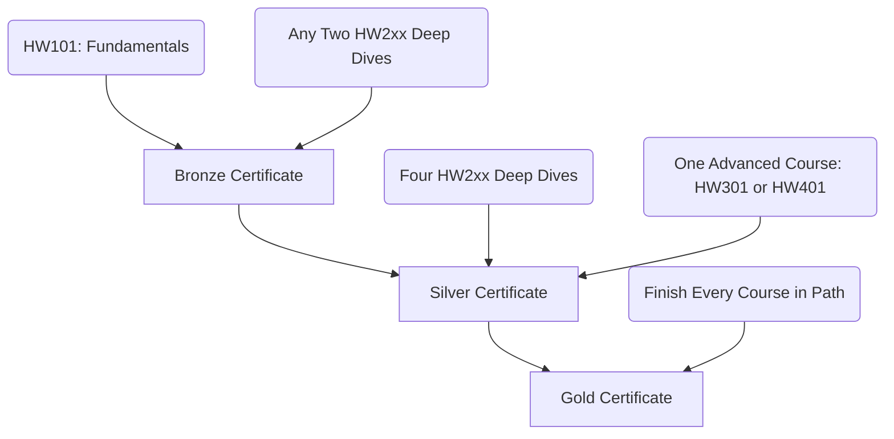

To reward study and dedication, Open Tech Academy offers shareable certificates for completed courses and full learning pathways.

---

## Computer Hardware Path Certificate Tiers

Students working through the Computer Hardware path can earn tiered certificates based on completion milestones.

### Bronze Certificate
- **Requirements**: Complete `HW101` and any two `HW2xx` deep-dive courses.
- **Audience**: Ideal for showing a basic grasp of desktop hardware assembly and specific subsystems.

### Silver Certificate
- **Requirements**: Complete `HW101`, any four `HW2xx` deep-dive courses, and one advanced course (`HW301` or `HW401`).
- **Audience**: Demonstrates intermediate expertise across multiple subsystems and advanced integration principles.

### Gold Certificate
- **Requirements**: Complete all 9 courses in the Computer Hardware path.
- **Audience**: Our highest hardware credential, representing full mastery of PC building, motherboard architectures, expansion, and system integration.

---

## Public Certificate Verification

To ensure the validity of our credentials, we host a public verification lookup portal at [verify.opentechacademy.org](https://verify.opentechacademy.org).

- **How it Works**: Employers, teachers, and sponsors can enter the unique verification code printed on any Open Tech Academy certificate.
- **What it Returns**: The lookup queries our database and returns:
  - Recipient Name
  - Course or Learning Path Title
  - Issue Date
  - Expiration or Revocation status (if applicable)

<Info>
  The verification system is fully automated and runs serverless functions against our central PostgreSQL database to verify records in real time.
</Info>
