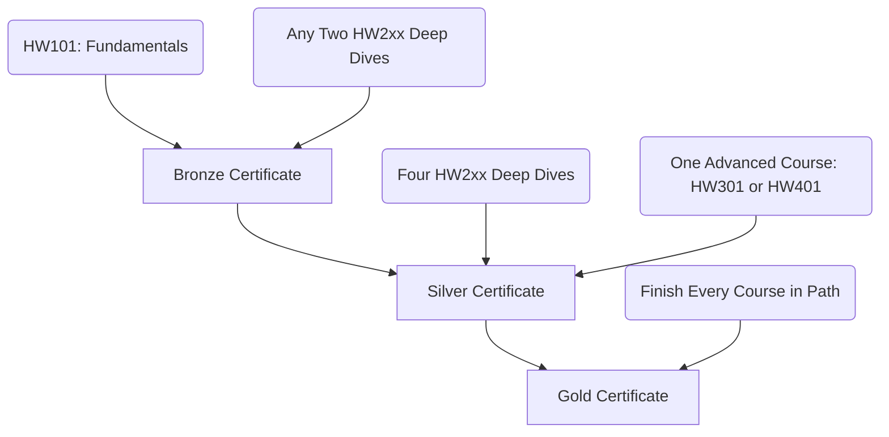

The **Open Tech Academy Learning Center** (available at [learn.opentechacademy.org](https://learn.opentechacademy.org)) is our central online learning portal. It hosts interactive, self-paced courses designed to take learners from absolute zero to technical competency.

---

## Navigating the Learning Center

We have structured the portal to be simple, interactive, and completely free. Here is how to accomplish your goals on the platform:

### 1. Enrolling and Browsing
- **Guest Browsing**: You do not need to sign up to browse lessons and read guides.
- **Account Enrollment**: Create a free student account using your email to save your progress, take module quizzes, submit assignments, and track certificate achievements.

### 2. Learning Modules
Courses are organized into sequential modules containing:
- **Lessons**: Guided readings explaining core concepts in plain English.
- **Video Walkthroughs**: Real hardware and setup recordings to see parts in action.
- **Interactive Checklists**: Field-ready checklists to confirm physical and diagnostic steps.

### 3. Assessments & Grading
- **Module Quizzes**: Brief interactive checks at the end of lessons to review terms.
- **Autograded Assignments**: Projects like workstation planning or system configuration verified programmatically in the background for instant feedback.
- **Final Exams**: Comprehension tests covering the entire course curriculum.

### 4. Earning Certificates
- Once you complete all module quizzes, assignments, and exams for a course, you earn a shareable certificate.
- Complete courses along the **Computer Hardware path** to earn tiered organization certificates.

---

## Course Catalog

Our Computer Hardware curriculum is fully published and available:

<CardGroup cols={2}>
  <Card title="HW101: Hardware Fundamentals" icon="gauge">
    *Beginner · 22 Hours*
    
    Learn what the main parts inside a computer do, how they connect, and how to recognize them. Topics include CPU, motherboard, RAM, storage, power, cooling, and basic troubleshooting.
  </Card>
  <Card title="HW201: CPU Deep Dive" icon="microchip">
    *Intermediate · 12 Hours*
    
    Learn CPU ideas in plain English: core and thread resource scheduling, clock speed vs. IPC architecture efficiency, thermal throttling, and CPU troubleshooting.
  </Card>
  <Card title="HW202: Motherboard Deep Dive" icon="circuit-board">
    *Intermediate · 12 Hours*
    
    Explore how the board connects parts, chipset lane allocations, firmware configurations (BIOS/UEFI revisions), and diagnostic steps for no-POST events.
  </Card>
  <Card title="HW203: RAM Deep Dive" icon="memory">
    *Intermediate · 11 Hours*
    
    Understand temporary workspaces, memory channel routing, timings, voltage, mixed kit compatibility issues, and hardware stability testing.
  </Card>
  <Card title="HW204: Storage Deep Dive" icon="database">
    *Intermediate · 11 Hours*
    
    Detail SATA and NVMe SSD interfaces, mechanical hard drives, lane-sharing limits, data backups, and cloning setups.
  </Card>
  <Card title="HW205: Expansion, Power & Cooling" icon="fan">
    *Intermediate · 11 Hours*
    
    Covers expansion cards, power supply rails and connectors (24-pin, CPU EPS, dedicated PCIe), case airflow design (intake/exhaust), and upgrade validation.
  </Card>
  <Card title="HW206: Graphics Deep Dive" icon="gamepad">
    *Intermediate · 13 Hours*
    
    Understand GPU pipelines, VRAM bandwidth, display connector standards, graphics driver updates, and display output troubleshooting.
  </Card>
  <Card title="HW301: Protocols & Connectors" icon="cable">
    *Advanced · 15 Hours*
    
    Learn internal buses, external interfaces, network protocols, cable lengths, and connector pinouts.
  </Card>
  <Card title="HW401: Full System Integration" icon="laptop-code">
    *Advanced · 18 Hours*
    
    Bring the hardware stack together: gather requirements, balance compatibility, design a full PC, validate builds, and complete an autograded system design capstone.
  </Card>
</CardGroup>

---

## Computer Hardware Path Certificate Tiers

Students working through the Computer Hardware path can earn tiered certificates based on completion milestones:

- **Bronze Certificate**: Complete `HW101` and any two `HW2xx` deep-dive courses.
- **Silver Certificate**: Complete `HW101`, any four `HW2xx` deep-dive courses, and one advanced course (`HW301` or `HW401`).
- **Gold Certificate**: Complete all 9 courses in the Computer Hardware path.

---

## Public Certificate Verification

To ensure the validity of our credentials, we host a public verification lookup portal at [verify.opentechacademy.org](https://verify.opentechacademy.org).

- **How it Works**: Enter the unique verification code located on the certificate.
- **What it Returns**: Confirms recipient name, course or learning path title, issue date, and validity status directly from our central database.
