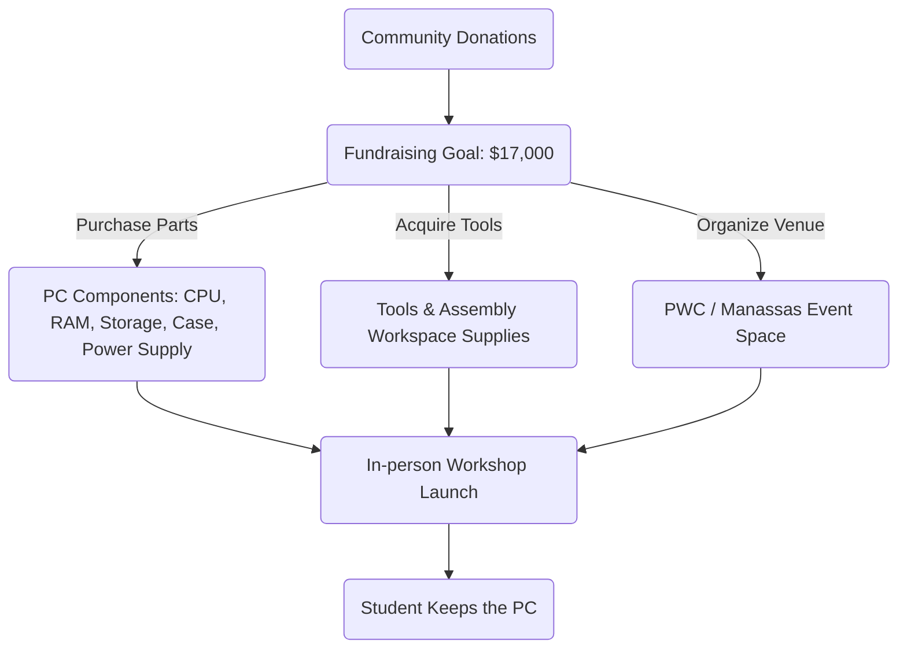

We are launching a new local community initiative: **Free Build-to-Own PC Workshops**. These events are designed to teach local students and hobbyists how computers work from the inside out, providing them with a finished computer they can use for school, coding, and creativity.

---

## Program Details

- **Location**: Prince William County or Manassas, Virginia.
- **Cost**: 100% free for all selected participants.
- **Goal**: Learn to source, assemble, configure, and troubleshoot a modern desktop computer.
- **Outcome**: Participants take home the computer they built, free of charge.

---

## Current Campaign & Fundraising Goal

To make the first cohort possible, we have set a public fundraising goal of **$17,000**. 

**Where the funds will go:**
- **PC Components**: Sourcing reliable, entry-level desktop hardware (CPUs, RAM, storage, motherboards, and power supplies).
- **Assembly Tools**: Screw drivers, static bands, thermal paste, and monitoring displays.
- **Venue & Safety**: Booking accessible training spaces and securing insurance.
- **Student Supplies**: Training handbooks, quick-reference guides, and operating system licenses.

---

## Join the Waitlist

We are currently gathering feedback and interest from local families and adult learners. 

- **Interest Form**: Open on the main website dashboard.
- **Updates**: Waitlist registrants will receive first-hand updates once venue bookings and component orders are finalized.
